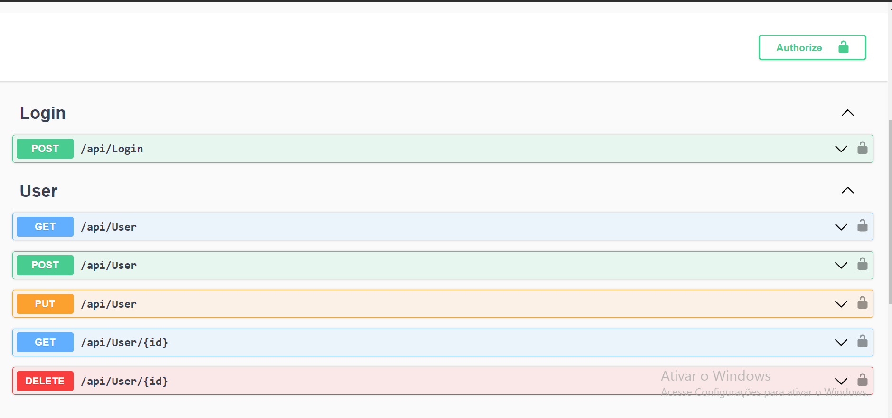

<h1 align="center"> MyUser - WebApi </h1>

    API REST utilizando .NET 7 criada para treinar

  <a href="#-tecnologias">Tecnologias</a>&nbsp;&nbsp;&nbsp;|&nbsp;&nbsp;&nbsp;
  <a href="#-projeto">Projeto</a>&nbsp;&nbsp;&nbsp;|&nbsp;&nbsp;&nbsp;
  <a href="#memo-licença">Licença</a>

  

 

  

## 🚀 Tecnologias

Esse projeto foi desenvolvido com as seguintes tecnologias:
 
- C# 
- Arquitetura com DDD
- Entity Framework
- SQL Server
- Swagger
- AutoMapper
- JWT Token
- Git e Github

## 💻 Projeto

O MyUser WebApi é uma api rest que possibilita cadastrar um usuario e fazer o login na aplicação para acessar outras funcionalidades da api.

## :memo: Licença

Esse projeto está sob a licença MIT.

---

Feito com ♥ by AlexandreSCorreia :wave: